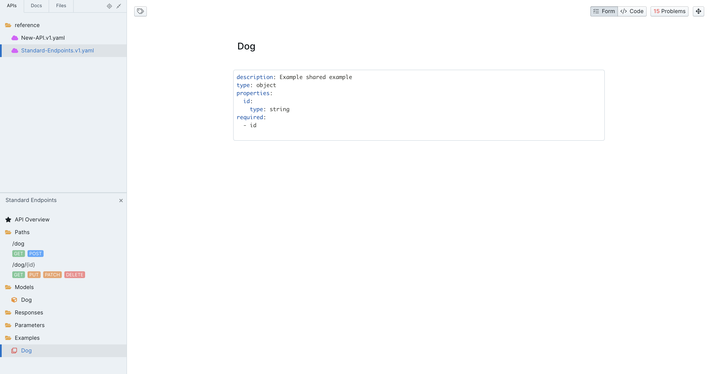
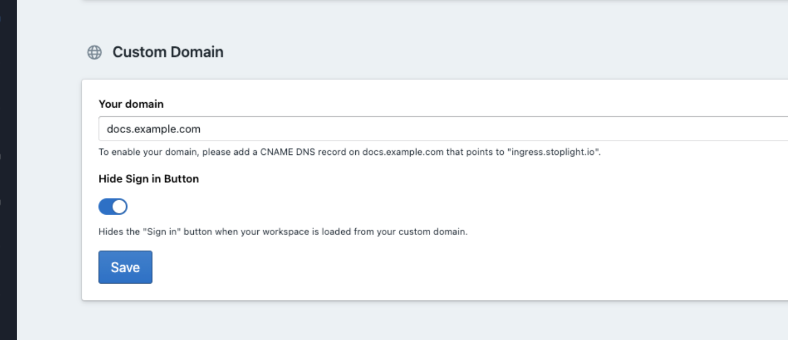

# Jan 27, 2021

## Bug Fixes

- Fixed the "About" dialog not appearing on Stoplight Studio Desktop for Windows.

# Jan 26, 2021

## OAS Shared Example Support

Stoplight Studio now supports [OpenAPI's Example Component Object](https://swagger.io/specification/#components-object). Leverage reusable examples across your API to create consistent and consumable API specs. 

## Custom Domain: Hide Sign In Button

Using Stoplight to host external docs on a custom domain? You can now [hide the "Sign In" button](https://roadmap.stoplight.io/c/103-add-an-option-to-hide-the-sign-in-button) in the left toolbar to avoid unwanted login requests.

# Jan 5, 2021

## Bug Fixes

- Fixed Studio Desktop's mocking returning an invalid response.
- Fixed a bug where Studio's preview panel would show an empty screen even though an Endpoint is selected.