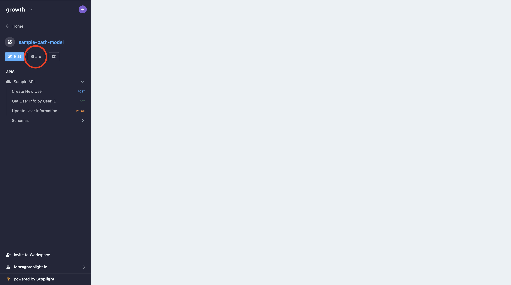
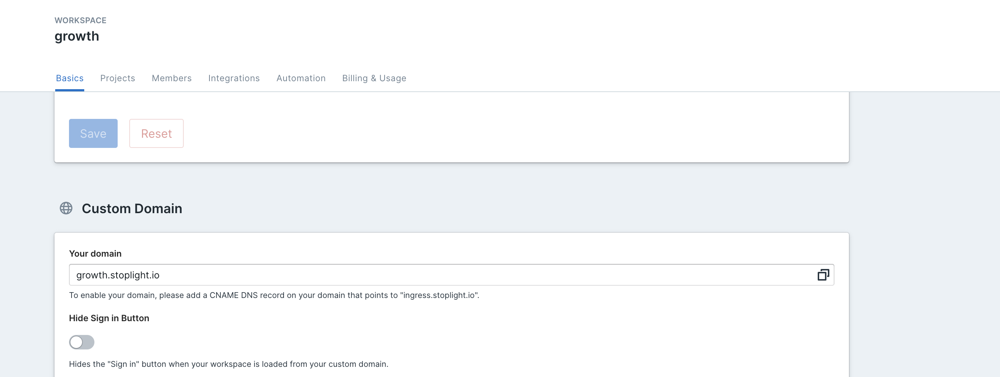

# Feb 10, 2021

## Bug Fixes

- Fixed unstaring in Explorer sometimes not unstarring.
- Fixed "API Overview" link in Project Docs not opening the API Overview page.

# Feb 9, 2021

## Project Share Button

We made it easier now more than ever to invite others to a Stoplight project. Use the Share button on the Project Docs page to invite members and non-members to collaborate on your API spec.

# Feb 3, 2021

## Custom Domain: Google Tag Manager Support

For Starter workspaces you can now use Google Tag Manager to track visitors to your docs via your customer domain. Simply go to Settings > Basics > Custom Domain and enter your Google Tag Manager ID to begin tracking visitors.

## Custom Domain: Hide Sign In Button

Using Stoplight to host external docs on a custom domain? You can now hide the "Sign In" button in the left toolbar to avoid unwanted login requests.

