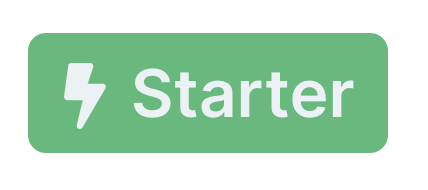
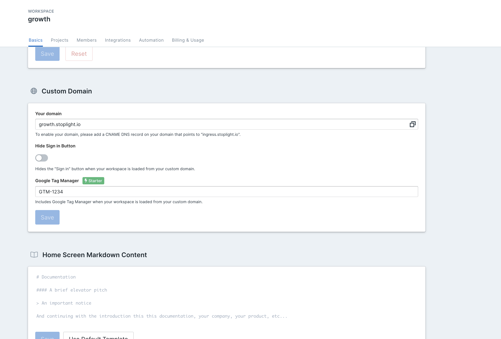

# Feb 24, 2021

## What's New?

- You can now manage Project visibility straight from the "Share" popup on the project docs page.

## Bug Fixes

- Fixed Studio Desktop project lists disappearing when deleting a project.
- Fixed a bug that stopped Studio Desktop from starting.
- Fixed Studio forms going out of sync with OpenAPI Spec.

# Feb 22, 2021

## What's New?

- Stoplight Studio now supports Global OAS tags.
- Private projects will now not appear in the Project Sidebar for Admins and Owners to reduce clutter. Admins and Owners can still manage private projects from the "Workspace Project Settings" page.

# Feb 17, 2021

## Bug Fixes

- Fixed a bug where a required model property is not marked "Required".

# Feb 10, 2021

## Bug Fixes

- Fixed unstaring in Explorer sometimes not unstarring.
- Fixed "API Overview" link in Project Docs not opening the API Overview page.

# Feb 9, 2021

## What's New?

- You can now manage your project's share settings directly from the Project Doc's "Share" button.

# Feb 4, 2021

## Bug Fixes

- Fixed Shared Examples not appearing as an option in the "Examples" dropdown.

# Feb 3, 2021

## Custom Domain: Google Tag Manager Support

For Starter workspaces you can now use [Stoplight's Google Tag Manager integration](https://roadmap.stoplight.io/c/64-google-tag-manager-integration) to track visitors to your docs via your customer domain. Simply go to Settings > Basics > Custom Domain and enter your Google Tag Manager ID to begin tracking visitors.

## Bug Fixes

- Fixed "API Overview" Table of Content item in a Project's Docs not redirecting the user to the API Overview page.
